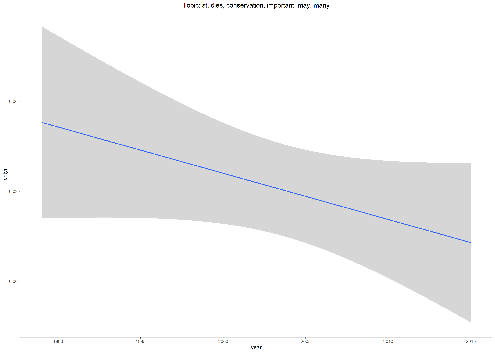

```{r setup, include=FALSE}
source("fit_lm.R")
knitr::opts_chunk$set(echo = TRUE)
library(revtools)
library(tidyverse)
library(broom)
```

## Identifying the evidence-base of interest

Using WoS I searched for the term "Conservation" in ecological journals (add the search string here). The number of papers returned was (n) and I restricted the search to those papers that had been cited more than 150 times in the literature.


```{r get .bib files, echo=TRUE}
# Get the files from the data folder
#file_names <- list.files(path="data",pattern = ".bib")

# Then import to a list
#data_list <- lapply(
#  file_names,
#  function(x){read_bibliography(x)}
#)
#str(data_list)
#dat<-bind_rows(data_list, .id = "column_label")
```

## Topic models
Using revtools::screen_topics I ran an LDA_Gibbs topic model with 30 topics. [need some justification for the number of topics - I went to max as it is a broad field] I then exported the topicmodels data as an .RDA file in R.  

```{r revtools, echo=TRUE}
#revtools::screen_topics(dat)
```

## Which topics are increasing over time and which are decreasing

I then used broom to run a linear regression between the number of papers and the year for each topic. As the number of papers is increasing generally I used the proportion of total papers published per year as the response variable

```{r use broom for lm models, echo=TRUE}
Topicmodels=readRDS("data/Topicmodels.rds")

d<-Topicmodels$raw%>% 
  group_by(year) %>% 
  mutate(year_total=n())%>% 
  group_by(topic, year) %>% 
  summarise(count=n(), year_tot=max(year_total)) %>% 
  mutate(cntyr=count/year_tot) %>% 
  drop_na()
d$year<-as.numeric(d$year)

out_le <- d %>%
  group_by(topic) %>%
  nest() %>% 
  mutate(model = map(data, fit_lm),
         tidied = map(model, tidy)) %>%
  unnest(tidied, .drop = TRUE) %>%
  filter(term %in% "(Intercept)")

```


```{r plot intercepts, echo=TRUE}
p <- ggplot(data = out_le,
            mapping = aes(x = topic, y = estimate,
                          ymin = estimate - 2*std.error,
                          ymax = estimate + 2*std.error,
                          group = topic, color = ifelse(p.value<0.05,"red", "blue"),
            ))+ 
  geom_pointrange(position = position_dodge(width = 1)) +
  geom_hline(yintercept=0, linetype="dashed")+
  scale_x_continuous(breaks = c(seq(1,30, 1))) + 
  coord_flip()+
  labs(x = "Topic number", y = "Intercept")+
  theme_classic()+
  theme(legend.position = "none")
p

#ggsave(p, file="results/estimate.png")
#dev.off()

```


```{r plot slope for each topic and save to file, echo=TRUE}
source("Topic_graph_funct.R")
# run graphing function on long df
topic.graph(d)

```



